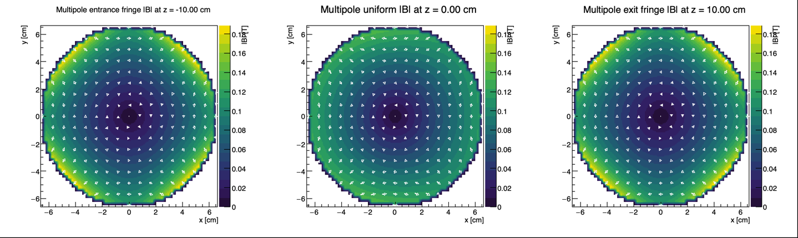
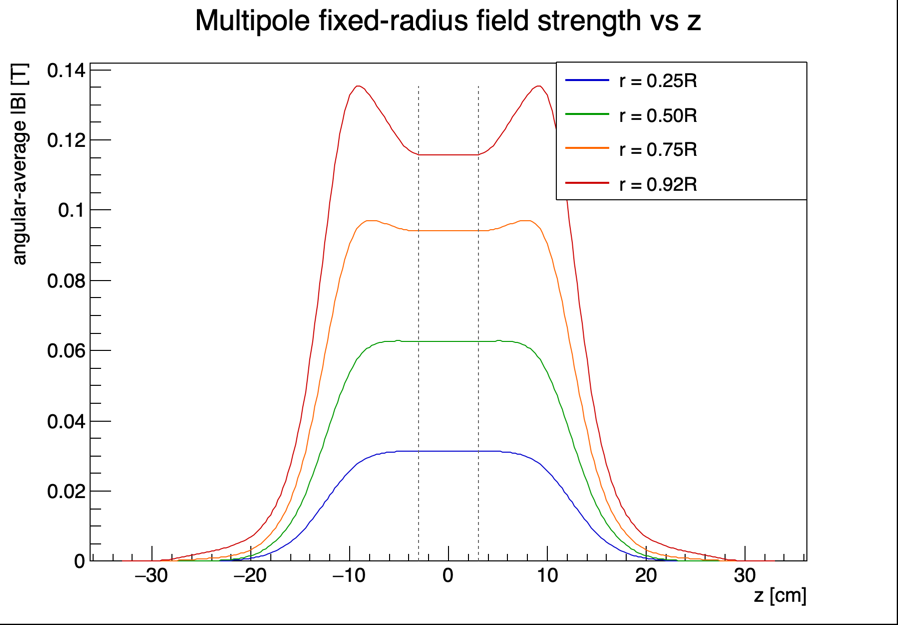
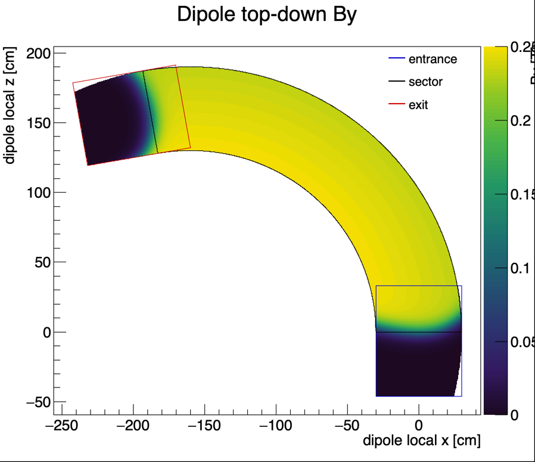
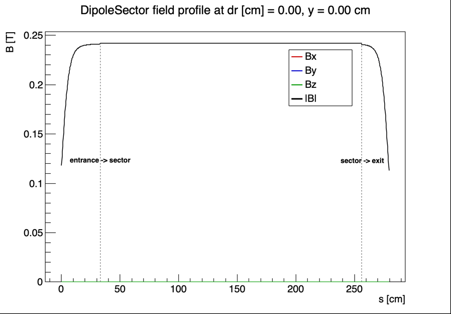

# Field-Map Visualization

The `visual/` directory contains ROOT-only macros for checking the generated
field maps. Run them from `build/`; the macros open interactive ROOT canvases
and do not save images by default.

## Quick Start

```bash
cd build
root -l ../visual/PlotAllFieldMaps.C
```

The default command opens:

- multipole transverse `x-y` field slices
- multipole fixed-radius field-strength profiles versus `z`
- one combined dipole top-down `By` map in physical dipole coordinates
- dipole longitudinal component profiles

The expected input files are:

```text
Multipole.bin
DipoleEntrance.bin
DipoleSector.bin
DipoleExit.bin
```

## Example Output

These images are static examples. The ROOT macros remain interactive unless you
save canvases manually from ROOT.

The example figures use these Hall probe settings:

```text
DipoleProbe    = 2338.00 Gauss
MultipoleProbe = 1659.98 Gauss
```

### Multipole





### Dipole





## What To Look For

### Multipole Slices

`PlotFieldSlices("Multipole.bin")` draws three square `x-y` views:

- entrance fringe
- uniform region
- exit fringe

All three pads use the same `|B|` color scale, so the colors can be compared
directly. White arrows show the transverse field direction from `Bx,By`; the
arrow size is qualitative, while the color gives the field strength in Tesla.

This plot is the fastest way to check the transverse multipole pattern, the
circular aperture mask, and whether entrance and exit fringe slices look
reasonable.

### Multipole Profile

`PlotFieldProfiles("Multipole.bin")` does not use the central axis, because
the multipole field is zero there by symmetry. Instead, it samples several
fixed radii and plots angular-average `|B|` versus `z`.

The legend uses radius fractions such as `r = 0.25R`, where `R` is the
multipole aperture radius. The dashed vertical lines mark the nominal
transition planes between entrance fringe, uniform region, and exit fringe.

Use this plot to see how the field turns on, stays flat, and turns off along
the beam direction.

### Dipole Top-Down Map

`PlotDipoleTopDown(...)` combines `DipoleEntrance.bin`, `DipoleSector.bin`, and
`DipoleExit.bin` into one physical top-down view. This is different from the
storage coordinates in the separate map files:

- entrance is stored as `(xB,zB)`
- sector is stored as `(dr,s)`
- exit is stored as `(xC,zC)`

The macro transforms all three into dipole-local `x-z` coordinates before
plotting. The bend should visibly curve toward `-x`. The color scale is `By`,
the dominant dipole bending-field component. Blue, black, and red outlines mark
the entrance, sector, and exit regions.

### Dipole Profiles

`PlotFieldProfiles("DipoleSector.bin")` and the corresponding entrance/exit
commands plot `Bx`, `By`, `Bz`, and `|B|` along the map's longitudinal
coordinate. For the sector map, horizontal labels mark the estimated
`entrance -> sector` and `sector -> exit` transition positions.

Use these profiles to check that `By` dominates, the sector is flat, and the
fringe regions connect in the expected order.

## Direct Commands

Run these from `build/`:

```bash
root -l '../visual/PlotFieldSlices.C("Multipole.bin")'
root -l '../visual/PlotFieldProfiles.C("Multipole.bin")'
root -l '../visual/PlotDipoleTopDown.C("DipoleEntrance.bin","DipoleSector.bin","DipoleExit.bin")'
root -l '../visual/PlotFieldProfiles.C("DipoleSector.bin")'
```

For a non-interactive smoke test, add `-b -q`:

```bash
root -l -b -q ../visual/PlotAllFieldMaps.C
```

## Macro Summary

`FieldMapCommon.C` contains the binary field-map reader, coordinate helpers,
and trilinear interpolation.

`PlotFieldSlices.C` draws multipole `x-y` slices with arrows. For dipole maps,
it remains a storage-coordinate diagnostic slice.

`PlotFieldProfiles.C` draws fixed-radius multipole profiles versus `z` and
dipole component profiles versus the map's longitudinal coordinate.

`PlotDipoleTopDown.C` draws the combined dipole physical top-down `By` map.

`PlotAllFieldMaps.C` is the default entrypoint.

`PlotField3D.C` is kept only as an explicit debug macro. It is not part of the
default workflow because the sparse ROOT 3D view is hard to interpret for the
curved dipole.
